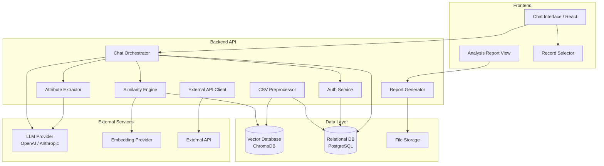

# Design Document: LLM Consultant Advisor

## Overview

O LLM Consultant Advisor é uma aplicação web que permite a consultores interagir com um LLM para analisar dados estruturados, encontrar registros similares em uma base de conhecimento vetorial e exportar relatórios de análise. O sistema combina processamento de linguagem natural, busca por similaridade semântica via embeddings e integração com APIs externas.

O fluxo principal é:
1. Consultor autentica e inicia uma sessão
2. Consultor descreve um Query_Item em linguagem natural no chat
3. O Attribute_Extractor interpreta a descrição e extrai atributos estruturados
4. A Similarity_Engine busca Records similares na Knowledge_Base vetorial
5. O LLM analisa os resultados e gera um Analysis_Report com explicabilidade
6. O consultor seleciona registros manualmente e pode exportar ou enviar para API externa

---

## Architecture

O sistema segue uma arquitetura em camadas com separação clara entre frontend, backend e serviços de dados.



### Decisões de Arquitetura

- **Backend**: Python (FastAPI) — ecossistema maduro para ML/NLP, integração nativa com bibliotecas de embeddings e LLMs
- **Frontend**: React + TypeScript — componentes reativos para chat em tempo real e seleção de registros
- **Vector Database**: ChromaDB (embutido, sem infraestrutura adicional) — armazena embeddings e permite busca por similaridade coseno; adequado para bases de conhecimento de pequeno porte, eliminando a necessidade de serviços externos de banco vetorial
- **LLM Provider**: Configurável via variável de ambiente (OpenAI GPT-4o, Anthropic Claude, etc.)
- **Embedding Model**: Configurável, padrão `text-embedding-3-small` (OpenAI) ou equivalente
- **Autenticação**: JWT com refresh tokens, sem dependência de serviço externo de identidade

---

## Components and Interfaces

### 1. Chat Orchestrator

Componente central que coordena o fluxo conversacional. Mantém o histórico da sessão e roteia mensagens para os serviços corretos.

```python
class ChatOrchestrator:
    def send_message(session_id: str, message: str) -> ChatResponse
    def get_history(session_id: str) -> list[ChatMessage]
    def create_session(consultant_id: str) -> Session
    def close_session(session_id: str) -> None
```

### 2. Attribute Extractor

Usa o LLM para interpretar a descrição em linguagem natural do Query_Item e extrair atributos estruturados compatíveis com os campos da Knowledge_Base.

```python
class AttributeExtractor:
    def extract(description: str, schema: KnowledgeBaseSchema) -> ExtractionResult
    # ExtractionResult contém: attributes (dict), confidence (float), missing_fields (list[str])
```

### 3. Similarity Engine

Gera embedding do Query_Item e executa busca ANN (Approximate Nearest Neighbor) no banco vetorial.

```python
class SimilarityEngine:
    def search(query_item: QueryItem, top_n: int, threshold: float) -> list[SimilarityResult]
    def explain(query_item: QueryItem, record: Record) -> AttributeContribution
    # SimilarityResult contém: record, similarity_score (float 0-1)
    # AttributeContribution contém: attribute_name, contribution_score, justification
```

### 4. CSV Preprocessor

Lê, limpa e vetoriza registros de um arquivo CSV. Suporta carga incremental.

```python
class CSVPreprocessor:
    def load(file_path: str) -> PreprocessingResult
    def reload(file_path: str) -> PreprocessingResult
    # PreprocessingResult: processed_count, skipped_count, error_log (list[str])
```

### 5. Report Generator

Gera o Analysis_Report em PDF e JSON a partir dos dados da sessão.

```python
class ReportGenerator:
    def generate(session_id: str, format: Literal["pdf", "json"]) -> bytes
```

### 6. External API Client

Envia os Records selecionados para o endpoint externo configurado.

```python
class ExternalAPIClient:
    def send(records: list[SelectedRecord], config: ExternalAPIConfig) -> SendResult
    # SendResult: success (bool), status_code (int), message (str)
```

### 7. Auth Service

Gerencia autenticação JWT e controle de sessão.

```python
class AuthService:
    def authenticate(credentials: Credentials) -> TokenPair
    def validate_token(token: str) -> ConsultantIdentity
    def refresh(refresh_token: str) -> TokenPair
```

### REST API Endpoints

| Método | Endpoint | Descrição |
|--------|----------|-----------|
| POST | `/auth/login` | Autenticação |
| POST | `/auth/refresh` | Renovar token |
| POST | `/sessions` | Criar sessão |
| DELETE | `/sessions/{id}` | Encerrar sessão |
| POST | `/sessions/{id}/messages` | Enviar mensagem |
| GET | `/sessions/{id}/messages` | Histórico |
| GET | `/sessions/{id}/results` | Records similares |
| PATCH | `/sessions/{id}/selections` | Atualizar seleção |
| POST | `/sessions/{id}/report` | Gerar relatório |
| POST | `/sessions/{id}/export` | Exportar relatório |
| POST | `/sessions/{id}/send-external` | Enviar para API externa |
| POST | `/admin/knowledge-base/upload` | Upload CSV |
| GET | `/admin/knowledge-base/status` | Status da KB |

---

## Data Models

### Session

```python
@dataclass
class Session:
    id: str                          # UUID
    consultant_id: str
    created_at: datetime
    last_activity_at: datetime
    status: Literal["active", "expired", "closed"]
    query_item: QueryItem | None
    selected_record_ids: list[str]
```

### ChatMessage

```python
@dataclass
class ChatMessage:
    id: str
    session_id: str
    role: Literal["user", "assistant", "system"]
    content: str
    timestamp: datetime
    metadata: dict                   # ex: {"type": "attribute_confirmation"}
```

### QueryItem

```python
@dataclass
class QueryItem:
    id: str
    session_id: str
    raw_description: str             # texto original do consultor
    extracted_attributes: dict       # atributos extraídos pelo Attribute_Extractor
    confirmed: bool
    embedding: list[float] | None
```

### Record

```python
@dataclass
class Record:
    id: str
    source_row_hash: str             # hash SHA-256 da linha original do CSV
    attributes: dict                 # campos do CSV normalizados
    embedding: list[float]
    created_at: datetime
    updated_at: datetime
```

### SimilarityResult

```python
@dataclass
class SimilarityResult:
    record: Record
    similarity_score: float          # 0.0 a 1.0
    attribute_contributions: list[AttributeContribution]

@dataclass
class AttributeContribution:
    attribute_name: str
    contribution_score: float
    justification: str               # gerado pelo LLM
```

### AnalysisReport

```python
@dataclass
class AnalysisReport:
    id: str
    session_id: str
    generated_at: datetime
    summary: str
    patterns: list[str]
    differences: list[str]
    recommendations: list[Recommendation]
    explainability: list[SimilarityResult]
    knowledge_base_size: int
    confidence_note: str | None      # preenchido se KB insuficiente

@dataclass
class Recommendation:
    text: str
    supporting_record_id: str        # referência obrigatória a um Record
```

### ExternalAPIConfig

```python
@dataclass
class ExternalAPIConfig:
    endpoint_url: str
    auth_type: Literal["bearer", "api_key", "basic"]
    credentials: dict                # armazenado criptografado
    timeout_seconds: int = 30
```

### KnowledgeBaseSchema

```python
@dataclass
class KnowledgeBaseSchema:
    required_fields: list[str]
    optional_fields: list[str]
    text_fields: list[str]           # campos usados para geração de embedding
    id_field: str
```

---

## Correctness Properties

*A property is a characteristic or behavior that should hold true across all valid executions of a system — essentially, a formal statement about what the system should do. Properties serve as the bridge between human-readable specifications and machine-verifiable correctness guarantees.*

---

### Property 1: Completude do histórico de sessão

*Para qualquer* sequência de mensagens enviadas em uma sessão ativa, o histórico retornado deve conter todas as mensagens na ordem cronológica em que foram enviadas, sem omissões.

**Validates: Requirements 1.4**

---

### Property 2: Isolamento entre sessões

*Para qualquer* par de sessões distintas (S1, S2) pertencentes ao mesmo ou a consultores diferentes, as mensagens e dados de S1 não devem aparecer no histórico ou resultados de S2.

**Validates: Requirements 1.6, 7.5**

---

### Property 3: Extração de atributos produz resultado não vazio para descrições válidas

*Para qualquer* descrição de texto não vazia e não composta exclusivamente de espaços em branco, o Attribute_Extractor deve retornar pelo menos um atributo extraído.

**Validates: Requirements 2.2**

---

### Property 4: Query_Item confirmado fica disponível para busca

*Para qualquer* Query_Item que tenha sido confirmado pelo consultor, o sistema deve disponibilizá-lo com status `confirmed=True` e embedding gerado antes de iniciar a busca de similaridade.

**Validates: Requirements 2.5**

---

### Property 5: Ordenação decrescente dos resultados de similaridade

*Para qualquer* lista de SimilarityResults retornada pela Similarity_Engine, os scores de similaridade devem estar em ordem estritamente não-crescente (score[i] >= score[i+1] para todo i).

**Validates: Requirements 3.2**

---

### Property 6: Cardinalidade dos resultados respeita N configurado

*Para qualquer* valor de N configurado e qualquer Knowledge_Base com pelo menos N records acima do threshold, a Similarity_Engine deve retornar exatamente N resultados. Para Knowledge_Bases com menos de N records acima do threshold, deve retornar todos os records elegíveis.

**Validates: Requirements 3.3**

---

### Property 7: Completude estrutural do Analysis_Report

*Para qualquer* Analysis_Report gerado, ele deve conter todos os campos obrigatórios (summary, patterns, differences, recommendations, explainability) e cada recomendação deve referenciar pelo menos um record_id válido presente nos resultados da sessão. Adicionalmente, a lista de attribute_contributions de cada SimilarityResult deve estar ordenada por contribution_score decrescente.

**Validates: Requirements 4.2, 4.3, 4.4**

---

### Property 8: Deduplicação pelo CSV Preprocessor

*Para qualquer* arquivo CSV contendo linhas duplicadas (mesmo conteúdo), o CSV_Preprocessor deve produzir um conjunto de Records onde cada source_row_hash é único — ou seja, nenhum hash aparece mais de uma vez na Knowledge_Base após o processamento.

**Validates: Requirements 5.2**

---

### Property 9: Round-trip de armazenamento de embeddings

*Para qualquer* Record processado pelo CSV_Preprocessor, após o armazenamento no banco vetorial, deve ser possível recuperar o Record pelo seu id e o embedding recuperado deve ser igual ao embedding gerado durante o processamento.

**Validates: Requirements 5.3, 5.4**

---

### Property 10: Carga incremental preserva records não modificados

*Para qualquer* Record já existente na Knowledge_Base cujo source_row_hash não tenha mudado após um reload do CSV, o embedding desse Record não deve ser recriado (o updated_at não deve ser alterado).

**Validates: Requirements 5.5**

---

### Property 11: Exportação JSON é round-trip fiel

*Para qualquer* Analysis_Report, serializar para JSON e depois deserializar deve produzir um objeto equivalente ao original (todos os campos com os mesmos valores).

**Validates: Requirements 6.2**

---

### Property 12: Rejeição de acesso não autenticado

*Para qualquer* endpoint protegido do sistema, uma requisição sem token JWT válido deve receber resposta com status HTTP 401 ou 403, sem retornar dados protegidos.

**Validates: Requirements 7.1, 7.2**

---

### Property 13: Auditoria de sessões

*Para qualquer* sessão criada no sistema, deve existir um registro de log contendo: consultant_id, timestamp de início, e — quando encerrada — timestamp de fim e lista de Query_Items utilizados.

**Validates: Requirements 7.3**

---

### Property 14: Expiração automática de sessões inativas

*Para qualquer* sessão cujo last_activity_at seja anterior a (now - 30 minutos), o status da sessão deve ser "expired" e tentativas de uso devem ser rejeitadas.

**Validates: Requirements 7.4**

---

### Property 15: Consistência do estado de seleção

*Para qualquer* sequência de operações de seleção e desseleção de Records, o conjunto de selected_record_ids deve refletir exatamente o estado após a última operação, e o contador de selecionados deve ser igual ao tamanho desse conjunto.

**Validates: Requirements 8.3, 8.4, 8.6**

---

### Property 16: Disponibilidade da opção de envio condicionada à seleção

*Para qualquer* estado de sessão onde selected_record_ids está vazio, a ação de envio para API externa deve ser indisponível (retornar erro 400 ou equivalente). Para qualquer estado onde selected_record_ids contém ao menos um elemento, a ação deve estar disponível.

**Validates: Requirements 9.1**

---

### Property 17: Completude do payload enviado para API externa

*Para qualquer* conjunto de Records selecionados enviados para a API externa, o payload JSON deve conter, para cada Record: todos os atributos originais do Record e o similarity_score correspondente da sessão atual.

**Validates: Requirements 9.2**

---

### Property 18: Auditoria de operações de envio externo

*Para qualquer* operação de envio para API externa (bem-sucedida ou não), deve existir um registro de log contendo: timestamp, consultant_id, quantidade de Records enviados e status HTTP da resposta.

**Validates: Requirements 9.6**

---

## Error Handling

### Estratégia Geral

O sistema adota uma abordagem de "fail gracefully" — erros em componentes individuais não devem derrubar a sessão do consultor. Todos os erros são logados com contexto suficiente para diagnóstico.

### Erros por Componente

| Componente | Cenário de Erro | Comportamento |
|------------|----------------|---------------|
| LLM Provider | Timeout / indisponibilidade | Retorna mensagem de erro descritiva ao consultor; registra em log; sessão permanece ativa |
| Attribute Extractor | Atributos insuficientes extraídos | Solicita informações adicionais ao consultor via chat |
| Similarity Engine | Knowledge_Base vazia | Informa consultor que nenhum resultado foi encontrado |
| Similarity Engine | Nenhum resultado acima do threshold | Informa consultor com threshold atual e sugere ajuste |
| CSV Preprocessor | Campos obrigatórios ausentes | Registra registros inválidos em log de erros; processa os válidos; retorna relatório de processamento |
| CSV Preprocessor | Arquivo CSV malformado | Rejeita o arquivo e retorna mensagem de erro descritiva |
| Report Generator | Falha na geração de PDF | Notifica consultor; preserva relatório na sessão; oferece exportação em JSON como alternativa |
| External API Client | Timeout / erro HTTP | Notifica consultor com código de status; preserva seleção para nova tentativa |
| Auth Service | Token expirado | Retorna 401 com indicação de necessidade de refresh |
| Auth Service | Sessão expirada por inatividade | Retorna 401 com mensagem específica de timeout de inatividade |

### Códigos de Erro Padronizados

```python
class ErrorCode(Enum):
    LLM_UNAVAILABLE = "LLM_001"
    LLM_TIMEOUT = "LLM_002"
    EXTRACTION_INSUFFICIENT = "ATTR_001"
    KB_EMPTY = "KB_001"
    KB_NO_RESULTS = "KB_002"
    CSV_INVALID_FORMAT = "CSV_001"
    CSV_MISSING_FIELDS = "CSV_002"
    EXPORT_FAILED = "EXP_001"
    EXTERNAL_API_ERROR = "EXT_001"
    EXTERNAL_API_TIMEOUT = "EXT_002"
    AUTH_EXPIRED = "AUTH_001"
    SESSION_EXPIRED = "AUTH_002"
    UNAUTHORIZED = "AUTH_003"
```

---

## Testing Strategy

### Abordagem Dual

O sistema utiliza dois tipos complementares de testes:

- **Testes unitários/de integração**: verificam exemplos específicos, casos de borda e condições de erro
- **Testes baseados em propriedades (PBT)**: verificam propriedades universais sobre todos os inputs possíveis

Ambos são necessários: testes unitários capturam bugs concretos em cenários específicos; testes de propriedade verificam a correção geral do sistema.

### Biblioteca de Property-Based Testing

**Python**: [`hypothesis`](https://hypothesis.readthedocs.io/) — biblioteca madura com suporte a estratégias compostas, shrinking automático e integração com pytest.

```bash
pip install hypothesis pytest
```

### Configuração dos Testes de Propriedade

Cada teste de propriedade deve:
- Executar no mínimo **100 iterações** (configurado via `@settings(max_examples=100)`)
- Conter um comentário de rastreabilidade no formato:
  `# Feature: llm-consultant-advisor, Property {N}: {texto da propriedade}`
- Corresponder a exatamente uma propriedade do design document

Exemplo de estrutura:

```python
from hypothesis import given, settings, strategies as st

# Feature: llm-consultant-advisor, Property 5: Ordenação decrescente dos resultados de similaridade
@given(st.lists(st.floats(min_value=0.0, max_value=1.0), min_size=1))
@settings(max_examples=100)
def test_similarity_results_ordered_descending(scores):
    results = build_similarity_results(scores)
    sorted_results = similarity_engine.rank(results)
    for i in range(len(sorted_results) - 1):
        assert sorted_results[i].similarity_score >= sorted_results[i+1].similarity_score
```

### Testes Unitários — Foco

Os testes unitários devem cobrir:
- Fluxo de autenticação (login, refresh, expiração)
- Criação e encerramento de sessão
- Fluxo completo de Query_Item (descrição → extração → confirmação → busca)
- Geração e exportação de Analysis_Report (PDF e JSON)
- Envio para API externa (sucesso e falha)
- Tratamento de cada código de erro definido
- Upload e reprocessamento incremental de CSV

### Mapeamento Propriedades → Testes PBT

| Propriedade | Estratégia Hypothesis | Componente Testado |
|-------------|----------------------|-------------------|
| P1: Completude do histórico | `st.lists(st.text())` para sequências de mensagens | ChatOrchestrator |
| P2: Isolamento entre sessões | `st.tuples(session_strategy, session_strategy)` | ChatOrchestrator |
| P3: Extração de atributos | `st.text(min_size=1)` filtrado para não-whitespace | AttributeExtractor |
| P4: Query_Item confirmado disponível | `query_item_strategy` | ChatOrchestrator |
| P5: Ordenação decrescente | `st.lists(st.floats(0,1))` | SimilarityEngine |
| P6: Cardinalidade top-N | `st.integers(min_value=1, max_value=50)` para N | SimilarityEngine |
| P7: Completude do relatório | `st.lists(record_strategy, min_size=1)` | ReportGenerator |
| P8: Deduplicação CSV | CSV com linhas duplicadas geradas | CSVPreprocessor |
| P9: Round-trip embeddings | `record_strategy` | CSVPreprocessor + ChromaDB |
| P10: Carga incremental | `st.lists(record_strategy)` com subset modificado | CSVPreprocessor |
| P11: Round-trip JSON | `report_strategy` | ReportGenerator |
| P12: Rejeição não autenticado | `st.sampled_from(PROTECTED_ENDPOINTS)` | AuthService |
| P13: Auditoria de sessões | `session_strategy` | AuthService + Logger |
| P14: Expiração por inatividade | `st.timedeltas(min_value=timedelta(minutes=31))` | SessionManager |
| P15: Consistência de seleção | `st.lists(st.booleans())` para sequência de toggles | SelectionManager |
| P16: Disponibilidade de envio | `st.lists(record_id_strategy)` (incluindo lista vazia) | ExternalAPIClient |
| P17: Completude do payload | `st.lists(record_strategy, min_size=1)` | ExternalAPIClient |
| P18: Auditoria de envios | `send_operation_strategy` | ExternalAPIClient + Logger |
